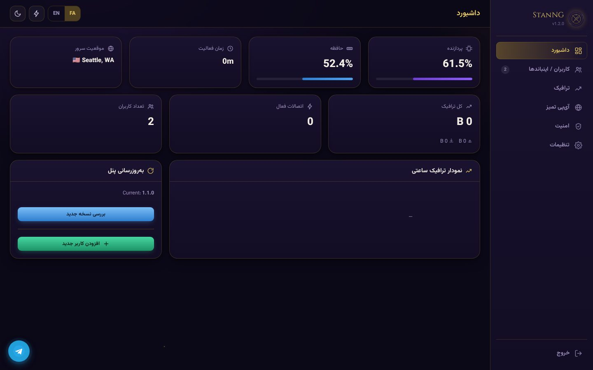
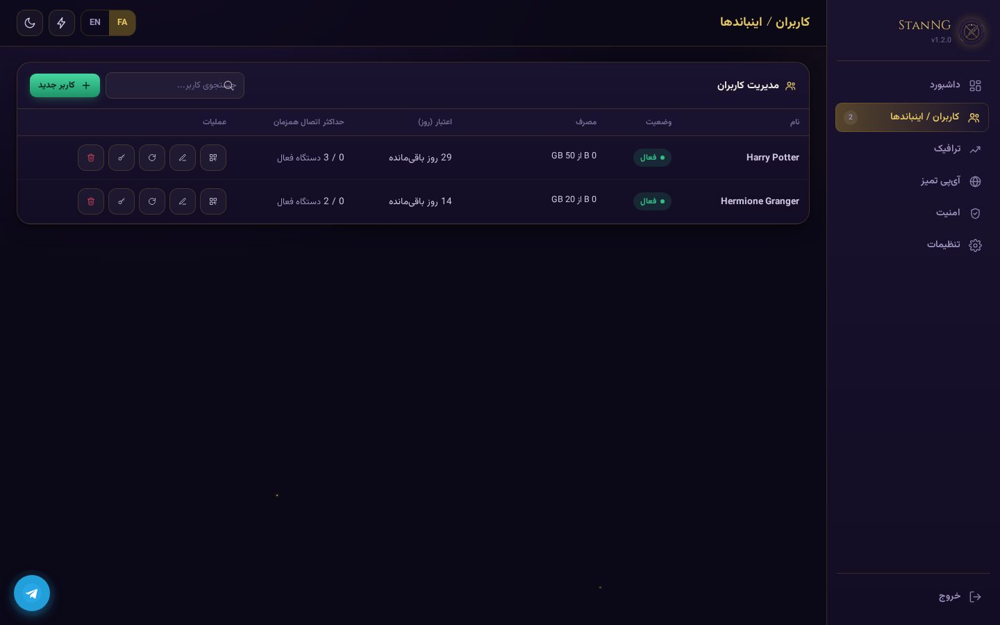
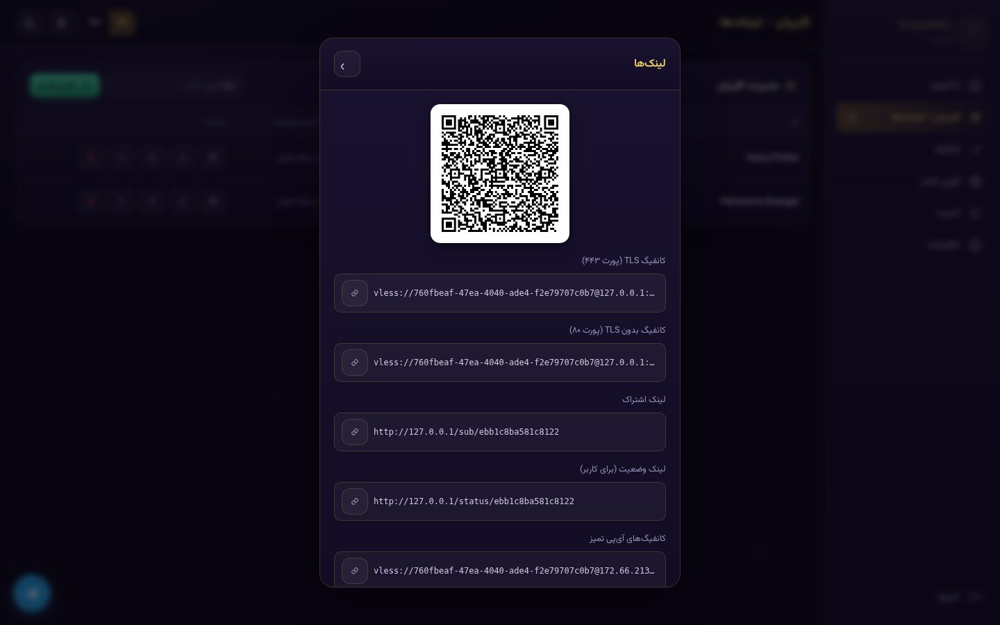
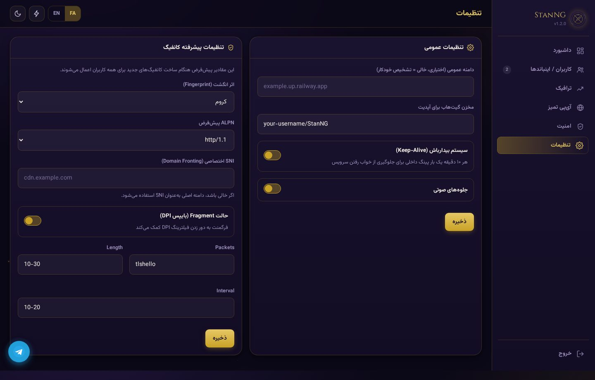

<div align="center">
  

  <h1>⚡ Parham v1.5.5</h1>
  <p><strong>یک پنل تک‌سرویسهٔ VLESS با ظاهر قرمز و مدرن</strong></p>
  <p>A single-service VLESS panel with a bold red interface.</p>

  <p>
    
    
    
  </p>
</div>

---

## 🔴 ویژگی‌ها

<table>
<tr>
<td width="50%">

**🪄 ساده و سبک**  
بدون دیتابیس؛ اطلاعات در یک فایل JSON محلی نگهداری می‌شود.

**📱 واکنش‌گرا**  
طراحی سازگار با موبایل و دسکتاپ.

**📊 محدودیت‌های پیشرفته**  
حجم، روز اعتبار، سقف درخواست و قطع خودکار.

**🔌 کنترل همزمان**  
محدودیت دستگاه و قفل IP.

</td>
<td width="50%">

**⚙️ تنظیمات کامل**  
Fingerprint، ALPN، SNI، Fragment و Transport.

**🔗 اشتراک v2rayNG**  
خروجی Plain Text سازگار با کلاینت.

**🛑 چرخش UUID**  
امکان بی‌اثر کردن لینک قبلی.

**🌗 دو زبانه**  
فارسی و انگلیسی با حالت روشن/تاریک.

</td>
</tr>
</table>

## 🆕 تغییرات نسخه 1.5.5

- ✅ رفع مشکلات OTA، آمار ترافیک، نمودار ساعتی و منوی ترافیک
- ✅ اضافه شدن XHTTP و پشتیبانی داخلی DOH
- ✅ دریافت دقیق‌تر آمار Xray با JSON
- ✅ شمارش دقیق اتصالات فعال بر اساس `last_seen`
- ✅ بهینه‌سازی کلی پنل و کاهش مصرف منابع

## 🖼 تصاویر

> این بخش از مسیرهای موجود داخل خود ریپو استفاده می‌کند؛ بنابراین لازم نیست تصاویر را دوباره آپلود کنید.

<div align="center">

| داشبورد | کاربران و اینباندها |
|:---:|:---:|
|  |  |

| اشتراک و QR | تنظیمات |
|:---:|:---:|
|  |  |

</div>

## 🚀 نصب سریع

### 🚂 Railway

1. ریپو را Fork یا Push کنید.
2. در Railway یک پروژه جدید از GitHub بسازید.
3. سرویس را Deploy کنید.
4. بعد از اجرا به `/setup` بروید و حساب مدیریتی را بسازید.

### 🌐 Render

1. ریپو را به Render متصل کنید.
2. یک Web Service بسازید.
3. `render.yaml` را Deploy کنید.
4. بعد از اجرا به `/setup` بروید.

### 💻 اجرای محلی

```bash
git clone https://github.com/parham101112131415/stanng.git
cd stanng
pip install -r requirements.txt
python main.py
```

سپس:

```text
http://localhost:8000/setup
```

## 🧭 راه‌اندازی اولیه

1. وارد `<your-domain>/setup` شوید.
2. نام کاربری و رمز عبور مدیریتی را بسازید.
3. از بخش اینباندها کاربران را ایجاد کنید.
4. از تنظیمات پیشرفته، Transport و سایر پارامترها را تنظیم کنید.

## 🔧 متغیرهای محیطی

| متغیر | پیش‌فرض | توضیح |
|---|---:|---|
| `PORT` | `8000` | پورت اجرا |
| `SECRET_KEY` | خودکار | کلید رمزنگاری نشست‌ها |
| `BASE_PATH` | `""` | مسیر پایه اختیاری، مانند `/stan` |

## 📚 API

| مسیر | متد | توضیح |
|---|---|---|
| `/api/login` | POST | ورود و دریافت توکن |
| `/api/users` | GET / POST | دریافت یا ایجاد کاربر |
| `/api/users/<uid>` | PUT / DELETE | ویرایش یا حذف کاربر |
| `/api/users/<uid>/rotate` | POST | چرخش UUID |
| `/api/settings` | GET / PUT | تنظیمات عمومی و پیشرفته |
| `/api/status` | GET | وضعیت CPU، RAM و دیسک |
| `/api/update` | POST | آپدیت پنل |
| `/sub/<uid>` | GET | لینک اشتراک عمومی |
| `/status/<uid>` | GET | صفحه وضعیت عمومی |

## 🔒 امنیت

- 🔐 رمز مدیریتی قوی انتخاب کنید.
- 🗂️ فایل `data.json` شامل اطلاعات حساس است و نباید عمومی شود.
- 🔄 در صورت نشت لینک اشتراک، UUID را Rotate کنید.
- 🔒 برای استفاده عمومی HTTPS توصیه می‌شود.

## 📜 مجوز

این پروژه تحت مجوز **MIT** منتشر شده است.

<div align="center">

**Parham — ساده، سبک و سریع ⚡**

</div>
